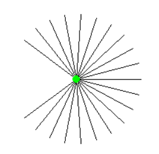
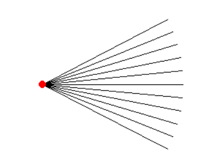
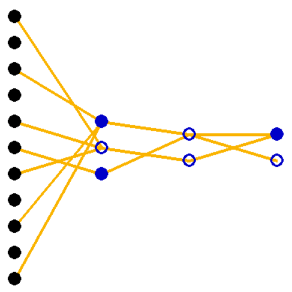
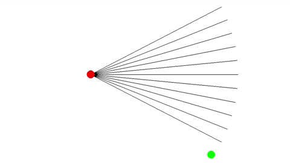
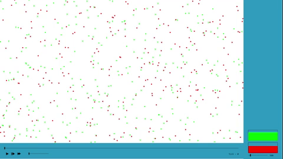
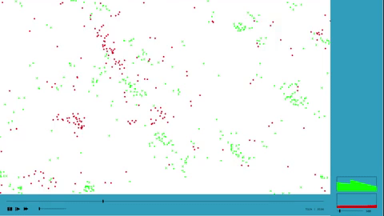
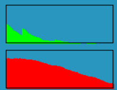
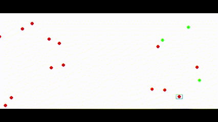
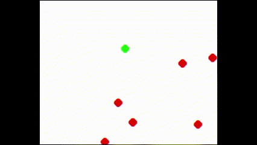
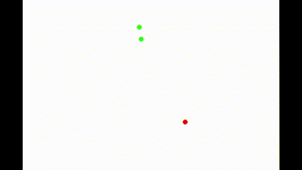

# Natural Selection simulator

This project is a 2D simulation that investigates the process of natural selection, a fundamental principle in the theory of evolution originally proposed by Charles Darwin. In this simulation, both predators and prey compete for survival. Each entity possesses an artificial neural network as their "brain" and uses their field of view as input to navigate the environment. At each generation, a random mutation appears, which can prove advantageous or disadvantageous to their survival. The ultimate goal is to survive long enough to reproduce, and entities that develop favorable mutations will be more likely to do so.  
This simulation offers a compelling illustration of the fundamental principles that underlie natural selection, providing insight into how organisms adapt and evolve in response to their environment.

# Simulation Mechanics
At the start of the simulation, a small number of entities are spawned, comprising both predators and prey. The maximum population of prey is kept much higher than that of predators to prevent their large-scale extinction. Both predators and prey share the following properties:
- Speed and an angular velocity to move around the map
- Moving consumes energy
- A split charge. When full, they split and generate a new entity with a mutation. The charge must then be replenished.

## Preys
Prey are represented as green dots. The field of view of a prey, represented as a lidar, is shown in the image below.

The properties of prey are as follows:
- A wide yet short field of view
- The split charge restores over time. Once it has reached a certain period, they split.
- When their energy drops to 0, they must rest and not move until they have reached a minimum level of energy.

## Predators
Predators are represented as red dots, and their field of view is shown in the next image.

The properties of predators are as follows:
- A narrow yet long field of view
- The ability to eat prey, recover energy, and fill their split charge
- The split charge empties over time
- When their energy drops to 0, they die
- After eating, they have a digestion period during which they cannot restore energy or split charge. This is to prevent massive and pointless over-reproduction of predators when hunting large prey colonies.

## Neural network
All entities possess an artificial neural network as their brain. The inputs to the network are the lidar rays of the field of view, and the outputs are the entity's speed and angular velocity. The neural network has weights (represented in orange if w > 0), biases (the neuron is filled if b > 0), and activation functions (tanh).

Predators can only detect preys in their field of view, and vice versa. The closer the prey, the higher the input.

## Mutations
Each time a new entity is born, it inherits the same neural network architecture as its parent, as well as a random mutation, which can manifest in the following ways:
- A modification of weights
- A modification of biases
- A new connection (a path of weights)

# The process of evolution
At the beggining of the simulation, entities have a very primitive brain, and only a few entities acquire the necessary mutation to facilitate movement. Those predators that remain stationary eventually die, while those that move increase their likelihood of prey capture and reproduction. The preys do not require movement at this stage, and hence, the absence of the mutation for movement neither proves favorable nor unfavorable to their survival.

After a short time, a phenomenon begins to appear: emergence. Emergence happens when complex systems or patterns arise from simple interactions between individuals. In this case, the predators begin to move in colonies or groups, enhancing their survival chances as a collective, rather than as individual predators. This grouping enables the predators to cover a larger area in search of prey.

At this point, only predators that move remain, excluding a few that may have lost their ancestor's mutation that facilitated movement due to a mutation. These stationary predators will ultimately die. As the predator population grows, the prey population significantly declines. The predators will face a shortage of food, which subsequently decreases their population.

Now, this is interesting times. The only preys that survive are those with exceptional speed, agility, or reflexes, while the surviving predators are those with the capability to pursue and capture prey. The remaining few predators that are not skilled hunters, but only lucky, will also survive. The situation is a crisis that both species must survive to ensure their continued existence. The survivors will reproduce and propagate new generations that inherit these useful skills.

The process repeats, with the better-adapted individuals of both species surviving, the preys reproducing rapidly, the predators having access to more abundant food and also reproducing, the prey population declining, and the predator population decreasing too. Subsequently, both species will face another crisis that will enhance their skills. These cyclic crises are inevitable in this environment and do not always result in a positive outcome. Sometimes, predators are unable to hunt preys and become extinct, while other times, preys are all hunted during predator overpopulation, leading to the extinction of both species.

# Ovservations
Here are some observations made during the simulation:

1. The predator, framed in blue, has developed the appropriate neural connections to chase and capture preys, giving it a significant advantage over other predators and enabling it to reproduce at a faster rate.  

2. Some preys do not require exceptional speed. For instance, one prey has acquired a skill that enables it to dodge predators. However, this skill may prove futile if a predator colony surrounds it.  

3. Some predators have adopted a waiting strategy. They remain stationary until prey enters their field of view, allowing them to quickly hunt the prey. This approach presents a vital advantage since the predator no longer loses energy moving, and thus can survive for longer.  

# Conclusion
Survival in this environment is a daunting task, and in most simulations, the entities do not overcome the second crisis. The constant parameters such as energy depletion, maximum speed, and field of view range have been meticulously adjusted to enhance survival. However, after numerous simulations, the pattern described above remains consistent. The best-adapted individuals that can cope with the prevailing conditions tend to survive longer.
> "It is not the strongest of the species that survives, nor the most intelligent that survives. It is the one that is the most adaptable to change." - Charles Darwin
